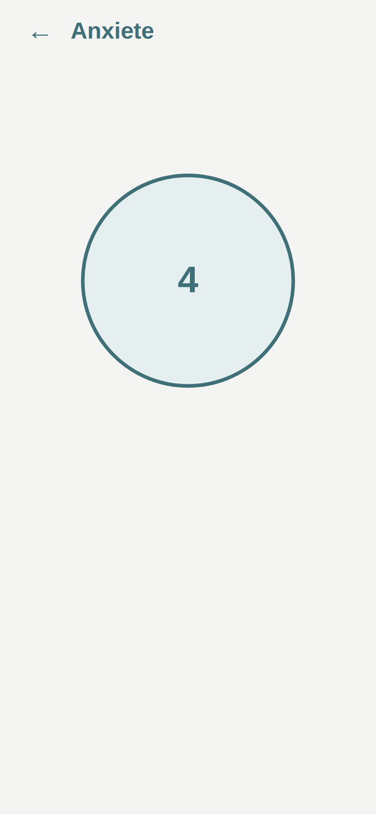
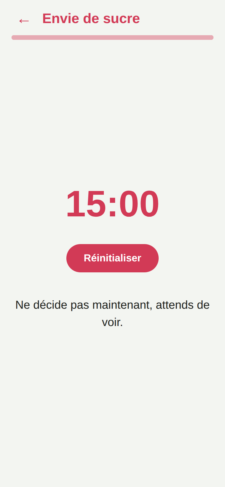
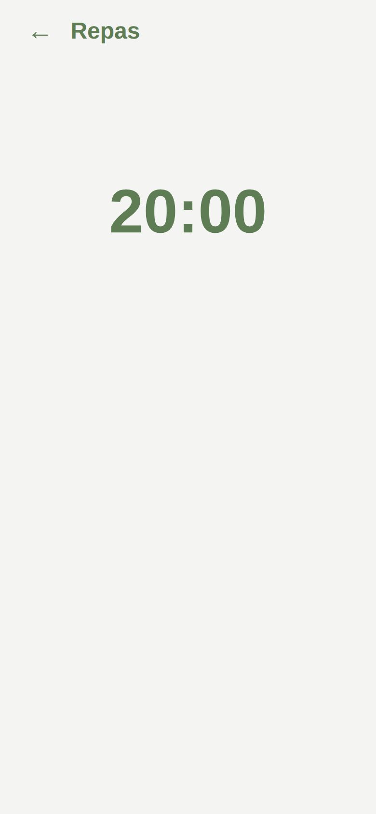

# Résilience

App Android perso, outil de crise pour un profil TDAH + anxieux. Trois écrans qui **guident une action au lieu de la réfléchir** : faire redescendre l'anxiété (respiration guidée Inspire/Expire puis ancrage 5-4-3-2-1), laisser passer une envie de sucre (minuteur d'attente), et ralentir un repas (minuteur + pause à mi-repas). Chaque écran se lance en un tap depuis un **widget d'écran d'accueil**, un menu permet de suivre l'**historique** des envies, et le thème s'adapte (clair / sombre / système).

| Anxiété | Envie de sucre | Repas |
|---|---|---|
|  |  |  |

## APK

L'APK est **buildé automatiquement** à chaque GitHub Release et attaché comme asset : page
[Releases](../../releases) du repo → `app-debug.apk`. Il est debug-signé, donc installable directement
(autoriser les "sources inconnues" sur le téléphone). GitHub Packages n'héberge pas d'APK brut, d'où
les Releases.

## Widgets sur l'écran d'accueil

L'app expose 3 widgets (Anxiété, Envie de sucre, Repas). Pour les poser :

1. Appui long sur une zone vide de l'écran d'accueil → **Widgets**.
2. Cherche **Résilience** : trois tuiles distinctes (une par mode).
3. Glisse celle voulue sur l'écran.

Un tap sur la tuile ouvre l'app directement sur l'écran correspondant et lance son minuteur.

## Fonctionnalités

- **Thème** clair / sombre / système (défaut système), réglable via le menu (hamburger).
- **Historique** : graphe du nombre d'ouvertures « Anxiété » et « Envie de sucre » par jour (menu).
- **Timelines** horizontales indiquant la progression du minuteur sur chaque écran.
- Bouton « précédent » Android équivalent à la flèche retour.

## Dev

```sh
npm install
npm test        # tests unitaires (Vitest)
npm run e2e     # tests de flux (Playwright)
npm run serve   # sert www/ sur http://127.0.0.1:5173
npm run apk     # cap sync + build APK debug en local (android/app/build/outputs/apk/debug/)
```

Stack : Capacitor 8 (WebView + code natif). Les widgets vivent dans
`android/app/src/main/java/coop/tilleuls/resilience/` (`ModeWidget` + un provider par mode) ; un tap
ouvre l'app via le deep-link `resilience://open?screen=<mode>&auto=1`.

## Sources des durées

- Respiration lente, expiration plus longue (4s / 6s, ~6 cycles/min) :
  [Frontiers 2025](https://www.frontiersin.org/journals/human-neuroscience/articles/10.3389/fnhum.2025.1605862/full),
  [ScienceDirect](https://www.sciencedirect.com/science/article/pii/S0965229923000249).
- Ancrage 5-4-3-2-1 :
  [Cleveland Clinic](https://health.clevelandclinic.org/54321-grounding-technique),
  [Healthline](https://www.healthline.com/health/anxiety/5-4-3-2-1-grounding-technique-for-anxiety).
